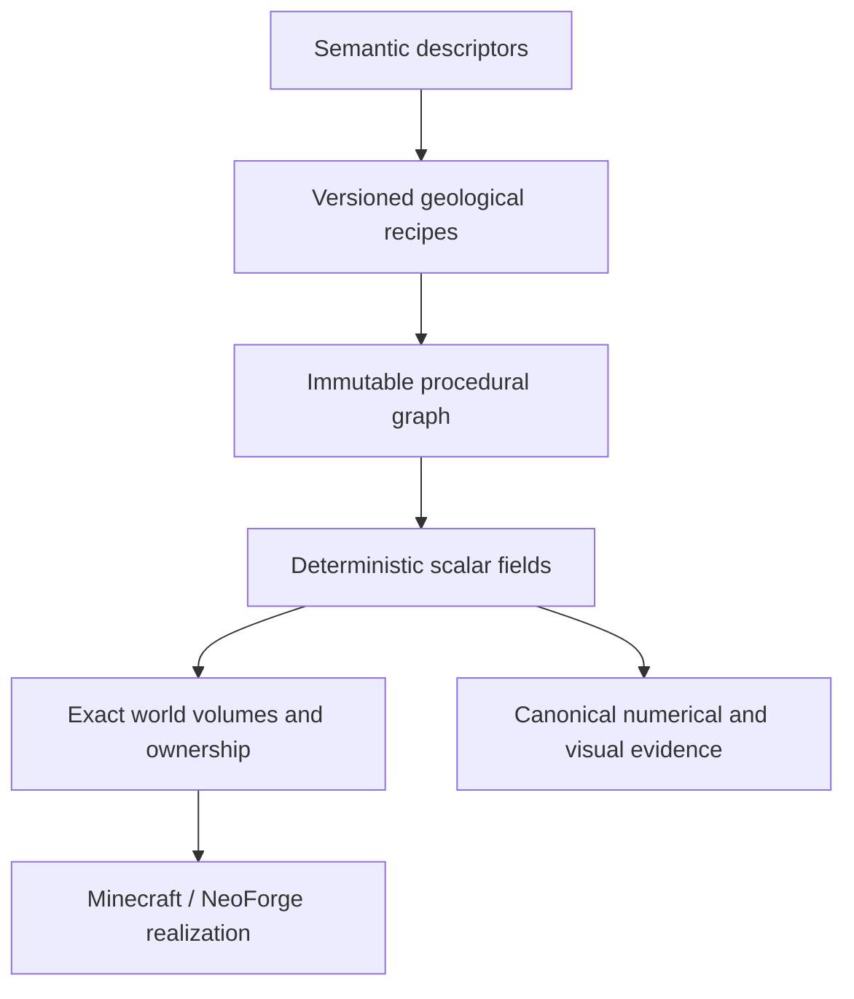

# Skyforge

[](https://github.com/ni-da-ba/skyforge/actions/workflows/ci.yml)

Skyforge is a deterministic, backend-neutral procedural world-synthesis engine for finite floating-island terrain. Minecraft 1.21.1 through NeoForge is its first runtime backend, but Minecraft concepts are deliberately kept out of the mathematical kernel.

The project is an architecture-first engineering effort rather than a finished content mod. Its central claim is that semantic landform descriptions can compile into inspectable procedural graphs, produce exact bounded terrain volumes, and then be realized by a game adapter without giving that adapter ownership of the terrain model.

## Why Skyforge exists

Most terrain generators begin at the chunk or block level. Skyforge begins with meaning:



This separation makes terrain behavior explainable and testable before it reaches Minecraft. It also leaves the core architecture open to other visualizers, games, or simulation backends.

## Engineering principles

- **Meaning before variation.** Descriptors express terrain intent; recipes decide how to construct it.
- **Hierarchy before detail.** Primary morphology establishes identity before local signals enrich it.
- **Determinism as a contract.** Traversal order, batching, and parallel evaluation must preserve canonical results.
- **Exact spatial ownership.** A Skyforge island is a finite three-dimensional volume, not an unbounded height field or a global world column.
- **Backend independence.** The build rejects Minecraft and NeoForge imports from neutral engine modules.
- **Evidence over screenshots.** Visual atlases accompany, but never replace, topology checks, exact grids, provenance, and pinned hashes.

## Durable development state

Current agent/lane state is maintained under [`docs/handoffs/`](docs/handoffs/README.md). New development agents should read the [program charter](docs/handoffs/PROGRAM_CHARTER.md), their canonical lane state (for Implementation: [`IMPLEMENTATION_STATE.md`](docs/handoffs/IMPLEMENTATION_STATE.md)), and the [cross-lane contracts](docs/handoffs/CROSS_LANE_CONTRACTS.md) before relying on conversational recollection.

The capability narrative below is retained as an architectural/reviewer snapshot and may lag the latest accepted milestone. The canonical current Implementation frontier is the lane state document plus merged Git history/tests.

## Current capabilities

The accepted Minecraft integration through **SF-IMP-0057** includes:

- immutable, typed procedural graphs and canonical serialization;
- deterministic reference evaluation and fixed-seed regression corpora;
- finite suspended volumes with independently controlled upper and underside morphology;
- five primary landform families: Massif, Tableland, Spine, Basin, and Lobed;
- bounded secondary relief with connectivity, closure, and clearance gates;
- backend-neutral world placement, surface-support, and collision-policy abstractions;
- exact Minecraft chunk realization through a NeoForge 1.21.1 adapter;
- vertically isolated terrain ownership for overlapping X/Z domains;
- compatibility-oriented structure admission and native biome integration;
- idempotent, exact-volume native surface population using live registry content;
- whole-volume physical admission before destructive realization, with terminal reject/admit decisions over finite native-occupancy evidence;
- deferred realization only through already-loaded stable chunks, without forcing future chunk generation;
- preservation of native post-processing semantics during deferred surface population;
- stable-chunk lighting and client synchronization after deferred low-level terrain writes.

A parallel backend-neutral authorship lane is now developing island-local environmental and hydrologic semantics that the Minecraft adapter can consume later without reversing the dependency direction.

The active Minecraft-integration boundary is **cross-volume native structure terrain projection**: terrain-matching structures rooted in one vertical world domain must not project onto an unrelated stacked Skyforge volume merely because it is the highest surface at the same X/Z. Skyforge is pre-release: it is not yet packaged as a general-purpose player-facing mod, and no stable API compatibility is promised.

## Engineering proof at a glance

Skyforge treats milestone acceptance as an engineering artifact. The repository keeps the numerical, runtime, and visual evidence that justified each accepted boundary rather than reducing progress to screenshots or feature claims.

| Claim | Representative evidence |
| --- | --- |
| **Base-world generation is isolated from Skyforge ownership.** | [SF-IMP-0052](docs/reviews/SF-IMP-0052-terrain-domain-isolation-acceptance.md) fingerprinted **63,234** protected native positions while realizing **35,070** Skyforge solid positions in the proof chunk; unowned native state remained unchanged. |
| **Exact 3-D island domains can reuse native biome content independently.** | [SF-IMP-0054](docs/reviews/SF-IMP-0054-biome-bridge-acceptance.md) exercised **25 eligible chunks** shared by vertically stacked forest and taiga volumes. Native vegetation produced persistent logs/leaves in both exact domains without visible cross-volume contamination. |
| **Native population is coordinated and idempotent per exact volume.** | [SF-IMP-0055](docs/reviews/SF-IMP-0055-surface-population-acceptance.md) completed **50 lifecycle keys** across 25 chunks and two volumes; an immediate equivalent replay executed **0** additional phases. |
| **Physical realization is atomic at whole-volume scale.** | [SF-IMP-0056](docs/reviews/SF-IMP-0056-physical-admission-acceptance.md) rejected a native-bedrock collision without mutation while admitting a clear upper volume only after **25 / 25** footprint chunks reported evidence; deferred catch-up completed with **0** pending chunks. |
| **Deferred native population preserves stable-chunk lifecycle semantics.** | [SF-IMP-0057](docs/reviews/SF-IMP-0057-deferred-post-processing-acceptance.md) preserved pre-existing native post-processing work, eliminated the unsupported stable-chunk fallback, completed **21 / 21** admitted surface-population phases, and synchronized deferred terrain to tracking clients. |
| **Procedural output is reproducible outside Minecraft.** | The fixed-seed and suspended-volume evidence tasks emit machine-readable descriptors/graphs, exact sampled data, numerical morphology metrics, SHA-256 identities, HTML review guides, and diagnostic images. |

The latest accepted runtime architecture and the active development boundary are summarized in [`Skyforge_Current_Runtime_Architecture.md`](docs/architecture/Skyforge_Current_Runtime_Architecture.md).

### Suggested reviewer path

For a compact technical review of the project:

1. Start with the [current runtime architecture](docs/architecture/Skyforge_Current_Runtime_Architecture.md) for ownership and dependency boundaries.
2. Read the [SF-IMP-0057 acceptance record](docs/reviews/SF-IMP-0057-deferred-post-processing-acceptance.md) for the latest accepted Minecraft runtime proof.
3. Read the [SF-IMP-0056 acceptance record](docs/reviews/SF-IMP-0056-physical-admission-acceptance.md) for the whole-volume admission invariant on which deferred population depends.
4. Inspect [ADR-0056](docs/decisions/ADR-0056-terrain-domain-generation-isolation.md), [ADR-0057](docs/decisions/ADR-0057-exact-volume-biome-bridge.md), and [ADR-0058](docs/decisions/ADR-0058-native-surface-population-planner.md) for the recent design decisions behind that runtime.
5. Inspect the [CI workflow](.github/workflows/ci.yml) for the repository’s build, backend-isolation, deterministic-evidence, and review-bundle gates.

## Modules

| Module | Responsibility |
| --- | --- |
| `skyforge-kernel` | Coordinates, field contracts, graph types, validation, canonical serialization, and reference evaluation |
| `skyforge-model` | Backend-neutral semantic descriptors and validation |
| `skyforge-recipes` | Versioned compilation from geological intent to procedural graphs |
| `skyforge-world` | Island placement, exact volumes, ownership, support evaluation, semantic fields, hydrologic planning, and world-composition policy |
| `skyforge-reference` | Deterministic sampling, topology analysis, evidence packages, visual atlases, and golden-corpus verification |
| `skyforge-neoforge-1211` | Minecraft 1.21.1 / NeoForge realization, native registry integration, exact-volume lifecycle adaptation, and development-only interactive fixtures |

The dependency direction is intentional: backend modules may depend on the neutral engine; the neutral engine may not depend on Minecraft.

## Build and test

Requirements:

- a 64-bit JDK 25 installation;
- no system Gradle installation (use the checked-in wrapper).

The backend-neutral artifacts target Java 21 bytecode for the Minecraft/NeoForge runtime. Gradle toolchains provision the required Java version where supported.

Linux or macOS:

```shell
./gradlew check
```

Windows:

```bat
gradlew.bat check
```

The repository compiles with `-Xlint:all -Werror`, runs JUnit tests across all modules, boots the NeoForge test environment, and enforces the backend-independence boundary.

## Reproduce the evidence

Generate and verify the six-member two-dimensional reference corpus:

```shell
./gradlew :skyforge-reference:fixedSeedCorpus
```

Generate the canonical finite suspended-volume evidence package:

```shell
./gradlew :skyforge-reference:suspendedVolumeEvidence
```

Both tasks write under `skyforge-reference/build/evidence/`. Evidence packages include machine-readable descriptors and graphs, exact sampled data, numerical morphology metrics, SHA-256 identities, HTML guides, and diagnostic images. Additional authorship and milestone-specific corpora are defined by their own Gradle tasks and acceptance records.

Interactive NeoForge clients use disposable worlds and are not production entry points.

## Project record

Skyforge intentionally keeps its engineering history visible. Architectural decisions, rejected approaches, acceptance criteria, numerical results, and interactive observations are recorded in:

- [`docs/architecture`](docs/architecture) - architecture baselines and subsystem boundaries;
- [`docs/decisions`](docs/decisions) - architectural decision records;
- [`docs/reviews`](docs/reviews) - milestone acceptance, interactive runbooks, and visual review;
- [`docs/authorship`](docs/authorship) - backend-neutral world-authorship milestones and semantics;
- [`docs/releases`](docs/releases) - versioned proof claims and release criteria.

The early [`v0.1 architecture-proof record`](docs/releases/Skyforge_v0.1.0_Release_Record.md) documents the original backend-neutral claim. Later ADRs and acceptance records extend that foundation into finite volumes and Minecraft realization; they do not imply that a public binary release already exists.

## Contributing

Skyforge is under active architectural development. Bug reports, technical review, and focused pull requests are welcome. Read [`CONTRIBUTING.md`](CONTRIBUTING.md) before proposing a change, especially if it affects deterministic identity, module boundaries, Minecraft ownership, or canonical evidence.

Please report security concerns privately as described in [`SECURITY.md`](SECURITY.md).

## License and trademarks

Skyforge is licensed under the [Apache License 2.0](LICENSE).

Minecraft is a trademark of Microsoft Corporation. NeoForge is maintained by its respective project contributors. Skyforge is an independent project and is not affiliated with or endorsed by Microsoft, Mojang Studios, or the NeoForge project.
