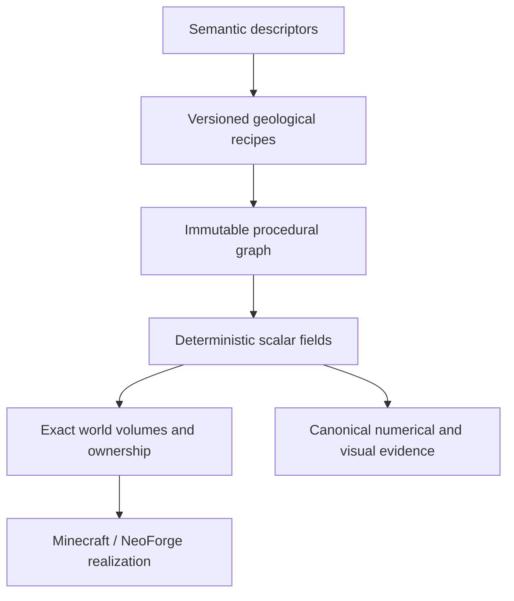

# Skyforge

[](https://github.com/ni-da-ba/skyforge/actions/workflows/ci.yml)

Skyforge is a deterministic, backend-neutral procedural world-synthesis engine for finite floating-island terrain. Minecraft 1.21.1 through NeoForge is its first runtime backend, but Minecraft concepts are deliberately kept out of the mathematical kernel.

The project is an architecture-first engineering effort rather than a finished content mod. Its central claim is that semantic landform descriptions can compile into inspectable procedural graphs, produce exact bounded terrain volumes, and then be realized by a game adapter without giving that adapter ownership of the terrain model.

## Why Skyforge exists

Most terrain generators begin at the chunk or block level. Skyforge begins with meaning:



This separation makes terrain behavior explainable and testable before it reaches Minecraft. It also leaves the core architecture open to other visualizers, games, or simulation backends.

## Engineering principles

- **Meaning before variation.** Descriptors express terrain intent; recipes decide how to construct it.
- **Hierarchy before detail.** Primary morphology establishes identity before local signals enrich it.
- **Determinism as a contract.** Traversal order, batching, and parallel evaluation must preserve canonical results.
- **Exact spatial ownership.** A Skyforge island is a finite three-dimensional volume, not an unbounded height field or a global world column.
- **Backend independence.** The build rejects Minecraft and NeoForge imports from neutral engine modules.
- **Evidence over screenshots.** Visual atlases accompany, but never replace, topology checks, exact grids, provenance, and pinned hashes.

## Current capabilities

The accepted implementation through **SF-IMP-0055** includes:

- immutable, typed procedural graphs and canonical serialization;
- deterministic reference evaluation and fixed-seed regression corpora;
- finite suspended volumes with independently controlled upper and underside morphology;
- five primary landform families: Massif, Tableland, Spine, Basin, and Lobed;
- bounded secondary relief with connectivity, closure, and clearance gates;
- backend-neutral world placement, surface-support, and collision-policy abstractions;
- exact Minecraft chunk realization through a NeoForge 1.21.1 adapter;
- vertically isolated terrain ownership for overlapping X/Z domains;
- compatibility-oriented structure admission and native biome integration;
- idempotent, exact-volume native surface population using live registry content.

The active development boundary is physical admission of planned Skyforge volumes before destructive Minecraft realization. Skyforge is pre-release: it is not yet packaged as a general-purpose player-facing mod, and no stable API compatibility is promised.

## Modules

| Module | Responsibility |
| --- | --- |
| `skyforge-kernel` | Coordinates, field contracts, graph types, validation, canonical serialization, and reference evaluation |
| `skyforge-model` | Backend-neutral semantic descriptors and validation |
| `skyforge-recipes` | Versioned compilation from geological intent to procedural graphs |
| `skyforge-world` | Island placement, exact volumes, ownership, support evaluation, and world-composition policy |
| `skyforge-reference` | Deterministic sampling, topology analysis, evidence packages, visual atlases, and golden-corpus verification |
| `skyforge-neoforge-1211` | Minecraft 1.21.1 / NeoForge realization, native registry integration, and development-only interactive fixtures |

The dependency direction is intentional: backend modules may depend on the neutral engine; the neutral engine may not depend on Minecraft.

## Build and test

Requirements:

- a 64-bit JDK 25 installation;
- no system Gradle installation (use the checked-in wrapper).

The backend-neutral artifacts target Java 21 bytecode for the Minecraft/NeoForge runtime. Gradle toolchains provision the required Java version where supported.

Linux or macOS:

```shell
./gradlew check
```

Windows:

```bat
gradlew.bat check
```

The repository compiles with `-Xlint:all -Werror`, runs JUnit tests across all modules, boots the NeoForge test environment, and enforces the backend-independence boundary.

## Reproduce the evidence

Generate and verify the six-member two-dimensional reference corpus:

```shell
./gradlew :skyforge-reference:fixedSeedCorpus
```

Generate the canonical finite suspended-volume evidence package:

```shell
./gradlew :skyforge-reference:suspendedVolumeEvidence
```

Both tasks write under `skyforge-reference/build/evidence/`. Evidence packages include machine-readable descriptors and graphs, exact sampled data, numerical morphology metrics, SHA-256 identities, HTML guides, and diagnostic images. CI regenerates the full evidence and publishes a compact human-review bundle.

Additional milestone-specific corpora and interactive NeoForge clients are documented beside their acceptance records under [`docs/reviews`](docs/reviews) and [`docs/runbooks`](docs/runbooks). Development clients use disposable worlds and are not production entry points.

## Project record

Skyforge intentionally keeps its engineering history visible. Architectural decisions, rejected approaches, acceptance criteria, numerical results, and interactive observations are recorded in:

- [`docs/architecture`](docs/architecture) - architecture baselines and subsystem boundaries;
- [`docs/decisions`](docs/decisions) - architectural decision records;
- [`docs/reviews`](docs/reviews) - milestone acceptance and visual review;
- [`docs/runbooks`](docs/runbooks) - reproducible interactive-validation procedures;
- [`docs/releases`](docs/releases) - versioned proof claims and release criteria.

The early [`v0.1 architecture-proof record`](docs/releases/Skyforge_v0.1.0_Release_Record.md) documents the original backend-neutral claim. Later ADRs and acceptance records extend that foundation into finite volumes and Minecraft realization; they do not imply that a public binary release already exists.

## Contributing

Skyforge is under active architectural development. Bug reports, technical review, and focused pull requests are welcome. Read [`CONTRIBUTING.md`](CONTRIBUTING.md) before proposing a change, especially if it affects deterministic identity, module boundaries, Minecraft ownership, or canonical evidence.

Please report security concerns privately as described in [`SECURITY.md`](SECURITY.md).

## License and trademarks

Skyforge is licensed under the [Apache License 2.0](LICENSE).

Minecraft is a trademark of Microsoft Corporation. NeoForge is maintained by its respective project contributors. Skyforge is an independent project and is not affiliated with or endorsed by Microsoft, Mojang Studios, or the NeoForge project.

