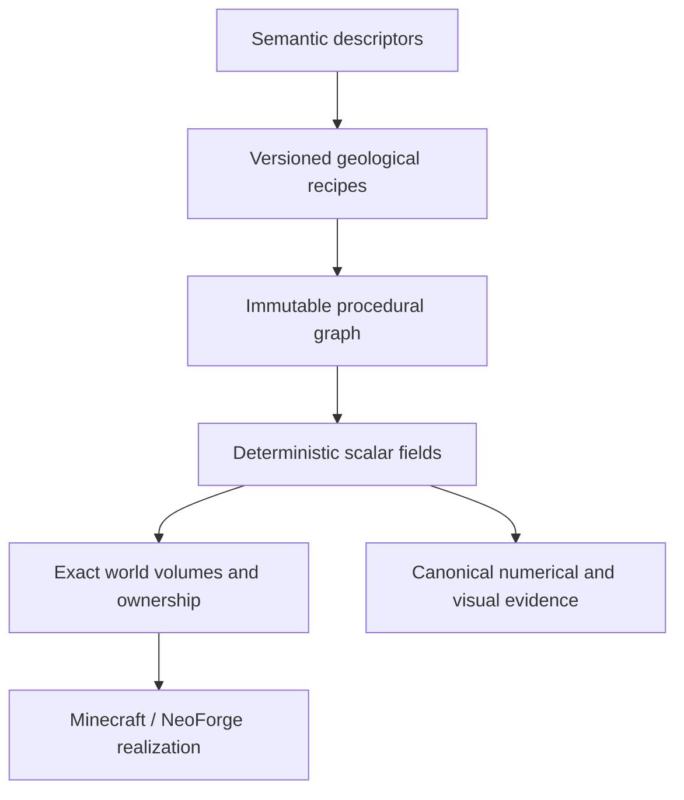

# Skyforge

[](https://github.com/ni-da-ba/skyforge/actions/workflows/ci.yml)

Skyforge is a deterministic, backend-neutral procedural world-synthesis engine for finite floating-island terrain. Minecraft 1.21.1 through NeoForge is its first runtime backend, but Minecraft concepts are deliberately kept out of the mathematical kernel.

The project is an architecture-first engineering effort rather than a finished content mod. Its central claim is that semantic landform descriptions can compile into inspectable procedural graphs, produce exact bounded terrain volumes, and then be realized by a game adapter without giving that adapter ownership of the terrain model.

## Why Skyforge exists

Most terrain generators begin at the chunk or block level. Skyforge begins with meaning:



This separation makes terrain behavior explainable and testable before it reaches Minecraft. It also leaves the core architecture open to other visualizers, games, or simulation backends.

## Engineering principles

- **Meaning before variation.** Descriptors express terrain intent; recipes decide how to construct it.
- **Hierarchy before detail.** Primary morphology establishes identity before local signals enrich it.
- **Determinism as a contract.** Traversal order, batching, and parallel evaluation must preserve canonical results.
- **Exact spatial ownership.** A Skyforge island is a finite three-dimensional volume, not an unbounded height field or a global world column.
- **Backend independence.** The build rejects Minecraft and NeoForge imports from neutral engine modules.
- **Evidence over screenshots.** Visual atlases accompany, but never replace, topology checks, exact grids, provenance, and pinned hashes.

## Durable development state

Current agent/lane state is maintained under [`docs/agent-state/`](docs/agent-state/README.md). Fresh agents should read the canonical program charter, their lane state, and the cross-lane contracts there before relying on conversational recollection.

Repository state, merged history, and tests are authoritative. Detailed architecture/review documents describe specific accepted boundaries but do not supersede the lane-state ledger when newer milestones have landed.

## Current capabilities

Skyforge's accepted architecture now spans backend-neutral world authorship, exact finite-volume realization, and executable Minecraft gameplay integration.

The backend-neutral engine provides:

- immutable typed procedural graphs, canonical serialization, deterministic reference evaluation, and fixed-seed evidence;
- finite suspended volumes with independent upper/underside morphology and exact three-dimensional ownership;
- five primary landform families — Massif, Tableland, Spine, Basin, and Lobed — plus accepted secondary, hybrid, provider, group, and archipelago composition machinery;
- explicit authored-to-realized identity/provenance rather than rediscovery from seed, position, or iteration order;
- island-local ecology, hydrology, cave, geology/material, and other semantic evidence that remains attached to the exact authored island;
- higher-order regional composition that can aggregate or relate multiple islands through explicit provenance while preserving each member's independent identity;
- accepted regional ecological opportunity, freshwater habitat, raw inter-island isolation/gap evidence, normalized Iron/Copper/Zinc geological opportunity, exact regional base-metal opportunity inventory, and scale-covariant built-in morphology surface-character diagnostics through **AUTH-0095**.

The accepted Minecraft/NeoForge lifecycle through **SF-IMP-0082** includes:

- exact-volume terrain realization while preserving BASE_WORLD as a separate generation domain;
- vertically stacked exact volumes at shared X/Z without collapsing them into one column-global surface;
- exact-volume biome bridging and deterministic/idempotent native surface population, including a human-accepted persistent forest/taiga ecology specimen;
- native structure candidate admission, bounded terrain accommodation, support, and piece-aware footprints;
- whole-volume physical admission with fail-closed PLANNED/REJECTED behavior before destructive realization;
- non-forcing deferred realization from immutable evidence, stable-chunk/client synchronization, save/reload, and mutation-inert actual-client reopen;
- native + authored cave composition;
- production post-cave native interior population including lakes, local modifications, ores, underground decoration, and fluid springs;
- generated-fluid provenance and boundary fencing;
- bounded performance convergence through SF-IMP-0077 and floating-island native-feature plausibility through SF-IMP-0078/0079;
- exact Minecraft carriers for all five SMALL / seed-skyforge production morphology families.

The current Implementation frontier is **SF-IMP-0083 / issue #284**, which completes the remaining built-in multi-seed/multi-scale morphology confidence boundary under the program's layered-validation policy. Cheap deterministic corpus evidence remains broad; expensive Minecraft lifecycle/reopen evidence is risk-representative rather than a 20-member Cartesian requirement. Human issue **#214** remains the visual/flight-quality authority; #267 and #283 track Massif traversal cadence and Tableland-vs-Massif family separation without reopening accepted carrier correctness.

Content / Experience is accepted through **C20**, including retained Create/Sable/Aeronautics mobility, shared atmosphere/glider/fauna behavior, Elytra-boost suppression, 1:1 Nether portal behavior, CC:Tweaked avionics/network/GPS capability, measured stock turtle freight/mining envelopes, and the first backend-neutral Iron/Copper/Zinc availability/guarantee policy. Music / Audio has its first accepted durable lane boundary at **MUS-0001**; subsequent source-verification work remains subordinate to the lane's human listening/source-recovery gates.

Live lane-state files remain the authoritative status surface when parallel work advances beyond this summary.

Skyforge is pre-release: it is not yet packaged as a general-purpose player-facing mod, and no stable API compatibility is promised.

## Engineering proof at a glance

Skyforge treats milestone acceptance as an engineering artifact. Representative accepted boundaries include:

| Claim | Representative evidence |
| --- | --- |
| **Base-world generation is isolated from Skyforge ownership.** | [SF-IMP-0052](docs/reviews/SF-IMP-0052-terrain-domain-isolation-acceptance.md) fingerprinted protected native positions while realizing Skyforge terrain; unowned native state remained unchanged. |
| **Exact 3-D island domains can reuse native biome content independently.** | [SF-IMP-0054](docs/reviews/SF-IMP-0054-biome-bridge-acceptance.md) exercised vertically stacked forest/taiga exact volumes without visible cross-volume contamination. |
| **Native population is coordinated and idempotent per exact volume.** | [SF-IMP-0055](docs/reviews/SF-IMP-0055-surface-population-acceptance.md) proved phase completion and zero-work immediate replay. |
| **Physical realization is atomic at whole-volume scale.** | [SF-IMP-0056](docs/reviews/SF-IMP-0056-physical-admission-acceptance.md) rejected conflicting native occupancy without mutation and admitted a clear volume only after complete footprint evidence. |
| **Deferred native population preserves stable-chunk lifecycle semantics.** | [SF-IMP-0057](docs/reviews/SF-IMP-0057-deferred-post-processing-acceptance.md) preserved native post-processing and synchronized deferred terrain to tracking clients. |
| **Measured performance pathologies were removed without changing generation semantics.** | SF-IMP-0070 through 0077 added profiling and bounded candidate, admission, materialization, and surface-query work; the canonical status/evidence pointers are in [`IMPLEMENTATION_STATE.md`](docs/agent-state/IMPLEMENTATION_STATE.md). |
| **Floating-island underground features obey plausible ownership/lifecycle rules.** | SF-IMP-0078/0079 constrain spring propagation to the interior shell and route cave-dependent multiface growth after composed caves; PRs #228/#236 and the Implementation state carry the accepted evidence. |
| **Procedural output is reproducible outside Minecraft.** | Fixed-seed and suspended-volume evidence tasks emit machine-readable descriptors/graphs, sampled data, morphology metrics, SHA-256 identities, HTML review guides, and diagnostic images. |

The current runtime architecture is summarized in [`Skyforge_Current_Runtime_Architecture.md`](docs/architecture/Skyforge_Current_Runtime_Architecture.md).

### Suggested reviewer path

For a compact current technical review:

1. Read the [program charter](docs/agent-state/PROGRAM_CHARTER.md), [validation policy](docs/agent-state/VALIDATION_POLICY.md), and [cross-lane contracts](docs/agent-state/CROSS_LANE_CONTRACTS.md).
2. Read the lane state files under [`docs/agent-state/`](docs/agent-state/) for current Authorship, Implementation, Content, Music / Audio, Audit, manual-gate, and verification state.
3. Read the [current runtime architecture](docs/architecture/Skyforge_Current_Runtime_Architecture.md) for ownership and lifecycle structure.
4. Use milestone acceptance records under [`docs/reviews`](docs/reviews) and merged PRs for detailed evidence behind individual claims.
5. Inspect the [CI workflow](.github/workflows/ci.yml) plus milestone-specific workflows for build, backend-isolation, deterministic-evidence, runtime, persistence, and showcase gates.

## Modules

| Module | Responsibility |
| --- | --- |
| `skyforge-kernel` | Coordinates, field contracts, graph types, validation, canonical serialization, and reference evaluation |
| `skyforge-model` | Backend-neutral semantic descriptors and validation |
| `skyforge-recipes` | Versioned compilation from geological intent to procedural graphs |
| `skyforge-world` | Island placement, exact volumes, ownership, support evaluation, semantic fields, hydrologic planning, and world-composition policy |
| `skyforge-reference` | Deterministic sampling, topology analysis, evidence packages, visual atlases, and golden-corpus verification |
| `skyforge-neoforge-1211` | Minecraft 1.21.1 / NeoForge realization, native registry integration, exact-volume lifecycle adaptation, and development-only interactive fixtures |

The dependency direction is intentional: backend modules may depend on the neutral engine; the neutral engine may not depend on Minecraft.

## Build and test

Requirements:

- a 64-bit JDK 25 installation;
- no system Gradle installation (use the checked-in wrapper).

The backend-neutral artifacts target Java 21 bytecode for the Minecraft/NeoForge runtime. Gradle toolchains provision the required Java version where supported.

Linux or macOS:

```shell
./gradlew check
```

Windows:

```bat
gradlew.bat check
```

The repository compiles with `-Xlint:all -Werror`, runs JUnit tests across all modules, boots the NeoForge test environment, and enforces the backend-independence boundary.

## Reproduce the evidence

Generate and verify the six-member two-dimensional reference corpus:

```shell
./gradlew :skyforge-reference:fixedSeedCorpus
```

Generate the canonical finite suspended-volume evidence package:

```shell
./gradlew :skyforge-reference:suspendedVolumeEvidence
```

Both tasks write under `skyforge-reference/build/evidence/`. Evidence packages include machine-readable descriptors and graphs, exact sampled data, numerical morphology metrics, SHA-256 identities, HTML guides, and diagnostic images. Additional authorship and milestone-specific corpora are defined by their own Gradle tasks and acceptance records.

Interactive NeoForge clients use disposable worlds and are not production entry points.

## Project record

Skyforge intentionally keeps its engineering history visible. Architectural decisions, rejected approaches, acceptance criteria, numerical results, and interactive observations are recorded in:

- [`docs/architecture`](docs/architecture) - architecture baselines and subsystem boundaries;
- [`docs/decisions`](docs/decisions) - architectural decision records;
- [`docs/reviews`](docs/reviews) - milestone acceptance, interactive runbooks, and visual review;
- [`docs/authorship`](docs/authorship) - backend-neutral world-authorship milestones and semantics;
- [`docs/music`](docs/music) - original soundtrack authorship, production workflow, cue records, and musical-language evidence;
- [`docs/releases`](docs/releases) - versioned proof claims and release criteria;
- [`docs/agent-state`](docs/agent-state/README.md) - concise live agent handoffs, program charter, and cross-lane contracts.

The early [`v0.1 architecture-proof record`](docs/releases/Skyforge_v0.1.0_Release_Record.md) documents the original backend-neutral claim. Later ADRs and acceptance records extend that foundation into finite volumes and Minecraft realization; they do not imply that a public binary release already exists.

## Contributing

Skyforge is under active architectural development. Bug reports, technical review, and focused pull requests are welcome. Read [`CONTRIBUTING.md`](CONTRIBUTING.md) before proposing a change, especially if it affects deterministic identity, module boundaries, Minecraft ownership, or canonical evidence.

Please report security concerns privately as described in [`SECURITY.md`](SECURITY.md).

## License and trademarks

Skyforge is licensed under the [Apache License 2.0](LICENSE).

Minecraft is a trademark of Microsoft Corporation. NeoForge is maintained by its respective project contributors. Skyforge is an independent project and is not affiliated with or endorsed by Microsoft, Mojang Studios, or the NeoForge project.
